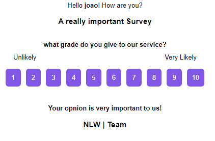

<h1 align="center">
NPS calculator API
</h1>
<p align="center">
This app was made during the NLW (Next Level Week), a one week event for Brazilian Developers. It's a simple Backend application that can be used to calculate a company's NPS.(Net Promoter Score)
</p>

<p align="center">

  

  

  <a href="https://github.com/GMkonan/MoveIt/commits/master">
      
  </a>

  
</p>

<p align="center">

</p>

## :information_source: Description
This API is used to send emails with surveys to users in the database. Then you can check with the API how many users respond to the specific survey and how good the NPS calculation (made entirely automatically) is.
## 🛠 Technologies
- [Typescript](https://typescriptlang.org/)
- [express](https://expressjs.com)
- [TypeORM](https://typeorm.io/#/)
- [supertest](https://www.npmjs.com/package/supertest)
- [nodemailer](https://nodemailer.com/about/)
- [sqlite3](https://www.sqlite.org/index.html)
- [handlebars](https://handlebarsjs.com)

### 📝 Todolist
- [x] Good documentation.
- [ ] Styled Mail Template.
## 🚀 Getting started

You need to have **Git** and **yarn** already installed in your machine
### 🔧 Installing
```bash
# Clone the repository
git clone https://github.com/GMkonan/RotaNodeJSAPI

# Enter repo folder
cd RotaNodeJSAPI

# Install dependencies
yarn
```
### ⚙ Executing
```bash
# Executing is really simple
yarn dev

#Now you can use apps like insomnia or postman to make requests to the API
# I recommend using beekeeper studio too to check the database
```

### Commands
```bash
# Create new migration
yarn typeorm migration:create -n MigrationName

# Run migration
yarn typeorm migration:run

# Run tests
yarn test

```

### Authors
- [GMkonan](https://www.linkedin.com/in/gmkonan/)
### License
Distributed under the MIT License. See [LICENSE](https://opensource.org/licenses/MIT) for more information.